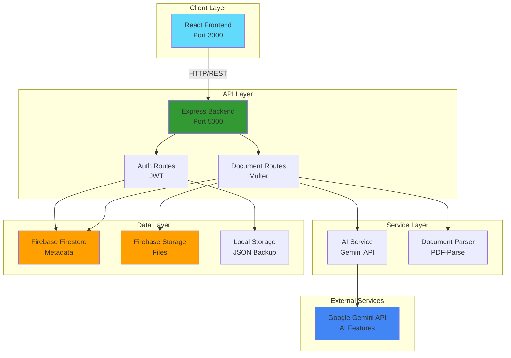
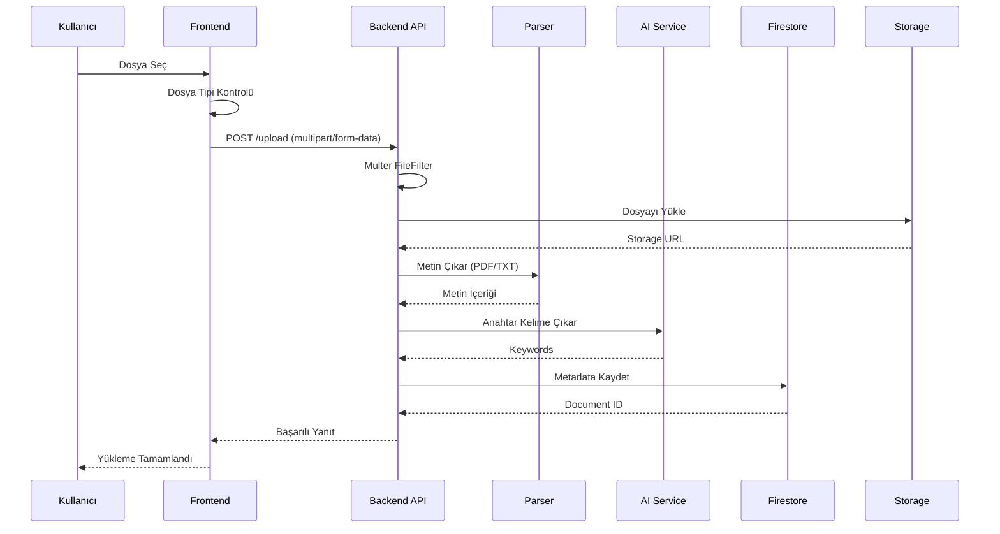

# SEMA - Semantic Analysis

Modern, akademik web arayüzlü akıllı doküman arama ve yönetim sistemi.

## Özellikler

- 📄 **Doküman Yükleme**: PDF ve TXT formatlarında dosya yükleme
- 🔍 **Anlamsal Arama**: Anahtar kelime ve doğal dil ile akıllı arama
- 💬 **AI Soru-Cevap**: Dokümanlarınıza dayalı doğal dil soruları sorma
- 📝 **Akıllı Özetler**: Otomatik kısa ve detaylı özet oluşturma
- 🔐 **Kullanıcı Kimlik Doğrulama**: Güvenli giriş ve kayıt sistemi
- 🎨 **Modern UI**: Karanlık tema ve mavi vurgularla modern tasarım

## Teknolojiler

### Frontend
- React 18
- Vite
- React Router
- Axios
- Lucide React (Icons)

### Backend
- Node.js
- Express.js
- Multer (File upload)
- JWT (Authentication)
- PDF-Parse, Mammoth (Document parsing)
- Google Gemini API (AI features - optional)

## Kurulum

### 1. Tüm bağımlılıkları yükleyin

```bash
npm run install:all
```

### 2. Ortam değişkenlerini ayarlayın

#### Backend

`backend` klasöründe `.env.example` dosyasını kopyalayıp `.env` olarak kaydedin:

```bash
cd backend
cp .env.example .env
```

Sonra `.env` dosyasını düzenleyip değerleri doldurun:

```env
PORT=5000
JWT_SECRET=your-super-secret-jwt-key
GEMINI_API_KEY=your-gemini-api-key-optional
```

**Notlar**: 
- **JWT_SECRET**: Kullanıcı kimlik doğrulama token'larını imzalamak için kullanılan gizli anahtar. Üretim ortamında mutlaka güçlü bir değer kullanın (örn: `openssl rand -base64 32` ile oluşturabilirsiniz).
- **GEMINI_API_KEY**: Google Gemini API anahtarı isteğe bağlıdır. Anahtar olmadan da temel özellikler çalışır, ancak AI özellikleri sınırlı olacaktır. Gemini API anahtarı almak için: https://makersuite.google.com/app/apikey

#### Frontend

`frontend` klasöründe `.env.example` dosyasını kopyalayıp `.env` olarak kaydedin:

```bash
cd frontend
cp .env.example .env
```

Sonra `.env` dosyasını düzenleyip Firebase yapılandırma bilgilerinizi ekleyin:

```env
VITE_FIREBASE_API_KEY=your-firebase-api-key
VITE_FIREBASE_AUTH_DOMAIN=your-project.firebaseapp.com
VITE_FIREBASE_PROJECT_ID=your-project-id
# ... diğer Firebase ayarları
```

Firebase yapılandırma bilgilerinizi Firebase Console'dan (https://console.firebase.google.com) alabilirsiniz.

### 3. Uygulamayı başlatın

Geliştirme modu (frontend + backend birlikte):
```bash
npm run dev
```

Veya ayrı ayrı:
```bash
# Frontend (port 3000)
npm run dev:frontend

# Backend (port 5000)
npm run dev:backend
```

## Kullanım

1. Tarayıcıda `http://localhost:3000` adresine gidin
2. Yeni bir hesap oluşturun veya giriş yapın
3. Dokümanlarınızı yükleyin (PDF, TXT)
4. Arama yapın, sorular sorun veya özetler oluşturun

## Proje Yapısı

```
docuMind/
├── frontend/          # React frontend uygulaması
│   ├── src/
│   │   ├── pages/     # Sayfa bileşenleri
│   │   ├── firebase/  # Firebase yapılandırması
│   │   ├── utils/     # Yardımcı fonksiyonlar
│   │   ├── App.jsx    # Ana uygulama
│   │   └── main.jsx   # Giriş noktası
│   ├── .env.example  # Örnek environment variables
│   └── package.json
├── backend/           # Express backend API
│   ├── routes/        # API route'ları
│   ├── services/      # AI servisleri
│   ├── data/          # Veri dosyaları (JSON) - gitignore'da
│   ├── uploads/       # Yüklenen dosyalar - gitignore'da
│   ├── audio/         # Podcast ses dosyaları - gitignore'da
│   ├── .env.example   # Örnek environment variables
│   └── server.js      # Ana sunucu
├── .gitignore         # Git ignore dosyası
└── package.json       # Root package.json
```

## Güvenlik Notları

⚠️ **ÖNEMLİ**: Bu projeyi GitHub'a yüklemeden önce:

1. ✅ `.env` dosyalarının `.gitignore`'da olduğundan emin olun
2. ✅ `.env.example` dosyalarını kontrol edin (gerçek değerler içermemeli)
3. ✅ Firebase credentials dosyalarının ignore edildiğinden emin olun
4. ✅ `package-lock.json` dosyalarının ignore edilip edilmeyeceğine karar verin (şu anda ignore ediliyor)
5. ✅ Yüklenen dosyalar (`backend/data/`, `backend/uploads/`) ignore ediliyor

## API Endpoints

### Authentication
- `POST /api/auth/register` - Kullanıcı kaydı
- `POST /api/auth/login` - Kullanıcı girişi

### Documents
- `GET /api/documents` - Tüm dokümanları listele
- `POST /api/documents/upload` - Doküman yükle (PDF, TXT)
- `POST /api/documents/search` - Dokümanlarda ara
- `POST /api/documents/ask` - Soru sor
- `GET /api/documents/:id/summary` - Doküman özeti al
- `POST /api/documents/summarize-text` - Metin özetleme
- `PUT /api/documents/:id/rename` - Dokümanı yeniden adlandır
- `DELETE /api/documents/:id` - Dokümanı sil

## Tasarım Çıktıları

### Kullanıcı Hikâyeleri (AI-Assisted)

Aşağıdaki kullanıcı hikâyeleri, AI (Claude) yardımıyla oluşturulmuş ve proje geliştirme sürecinde kullanılmıştır:

#### US-1: Doküman Yükleme
**Kullanıcı Hikâyesi**: Bir akademisyen olarak, PDF ve TXT formatındaki araştırma makalelerimi sisteme yükleyebilmek istiyorum, böylece daha sonra bunları arayabilir ve analiz edebilirim.

**Kabul Kriterleri**:
- Kullanıcı PDF ve TXT dosyalarını yükleyebilir
- Dosya boyutu maksimum 10MB olmalı
- Yüklenen dosyalar Firebase Storage'da güvenli şekilde saklanır
- Dosya metadata'sı Firestore'da kaydedilir

**AI Katkısı**: Claude, dosya yükleme akışını, hata yönetimini ve güvenlik kontrollerini önerdi.

#### US-2: Anlamsal Arama
**Kullanıcı Hikâyesi**: Bir araştırmacı olarak, dokümanlarımda doğal dil kullanarak arama yapabilmek istiyorum, böylece anahtar kelime bazlı aramadan daha etkili sonuçlar elde edebilirim.

**Kabul Kriterleri**:
- Kullanıcı doğal dil sorguları yazabilir
- Sistem Gemini API kullanarak anlamsal arama yapar
- Sonuçlar relevance skoruna göre sıralanır
- Arama sonuçları ilgili doküman bölümlerini gösterir

**AI Katkısı**: Claude, anlamsal arama implementasyonunu, embedding stratejisini ve sonuç sıralama algoritmasını önerdi.

#### US-3: AI Soru-Cevap
**Kullanıcı Hikâyesi**: Bir öğrenci olarak, yüklediğim ders materyallerine dayalı sorular sorabilmek istiyorum, böylece konuları daha iyi anlayabilirim.

**Kabul Kriterleri**:
- Kullanıcı doğal dil soruları sorabilir
- Sistem ilgili dokümanları bulur ve cevap üretir
- Cevaplar kaynak dokümanlara referans verir
- Hallucination riski minimize edilir

**AI Katkısı**: Claude, RAG (Retrieval-Augmented Generation) yaklaşımını, prompt engineering stratejisini ve kaynak doğrulama mekanizmasını önerdi.

#### US-4: Metin Özetleme
**Kullanıcı Hikâyesi**: Bir profesyonel olarak, uzun dokümanları hızlıca özetleyebilmek istiyorum, böylece zaman kazanabilirim.

**Kabul Kriterleri**:
- Kullanıcı metin girişi yapabilir veya doküman seçebilir
- Özet uzunluğu ayarlanabilir (10-100%)
- Özet dili seçilebilir (Türkçe/İngilizce)
- Özet kaliteli ve tutarlı olmalı

**AI Katkısı**: Claude, özetleme UI tasarımını, Gemini API entegrasyonunu ve özet kalitesi kontrol mekanizmasını önerdi.

#### US-5: Doküman Yönetimi
**Kullanıcı Hikâyesi**: Bir kullanıcı olarak, dokümanlarımı klasörler halinde organize edebilmek, yeniden adlandırabilmek ve çöp kutusuna taşıyabilmek istiyorum.

**Kabul Kriterleri**:
- Kullanıcı klasör oluşturabilir ve yönetebilir
- Dokümanlar klasörlere taşınabilir
- Soft delete (çöp kutusu) ve hard delete özellikleri var
- Duplicate name kontrolü yapılır

**AI Katkısı**: Claude, klasör yapısı tasarımını, soft delete implementasyonunu ve dosya organizasyon mantığını önerdi.

### Sistem Mimarisi Diyagramı

Aşağıdaki UML diyagramı, sistemin genel mimarisini göstermektedir:



### Mimari Karar Açıklamaları

#### Karar 1: Firebase Entegrasyonu

**AI Önerisi (Claude)**:
- Kullanıcı verilerini Firebase Firestore'a taşımak
- Dosyaları Firebase Storage'da saklamak
- Firebase Authentication kullanmak
- JSON dosyası yerine cloud-based veritabanı kullanmak

**İnsan Kararı**:
- Firebase entegrasyonu kabul edildi
- JSON dosyası sadece geçici/backup için bırakıldı
- Firebase'in ölçeklenebilirlik ve güvenlik avantajları nedeniyle tercih edildi

**Gerekçe**: 
- JSON dosyası ile veri saklama güvenlik riski taşıyordu
- Firebase, gerçek zamanlı senkronizasyon ve güvenlik kuralları sağlıyor
- Cloud-based çözüm, gelecekteki ölçeklenme ihtiyacını karşılıyor

#### Karar 2: RESTful API Mimarisi

**AI Önerisi (Claude)**:
- Express.js ile RESTful API tasarımı
- JWT tabanlı authentication
- Multer ile dosya yükleme
- Middleware pattern kullanımı

**İnsan Kararı**:
- RESTful API mimarisi kabul edildi
- GraphQL yerine REST tercih edildi
- Basit ve anlaşılır endpoint yapısı oluşturuldu

**Gerekçe**:
- REST, daha yaygın ve anlaşılır bir standart
- GraphQL'in ekstra karmaşıklığı bu proje için gerekli değil
- RESTful API, frontend-backend ayrımını netleştiriyor

#### Karar 3: AI Servis Entegrasyonu

**AI Önerisi (Claude)**:
- Google Gemini API kullanımı
- AI servislerini ayrı bir modülde toplamak
- Fallback mekanizması eklemek
- Prompt engineering ile hallucination riskini azaltmak

**İnsan Kararı**:
- Gemini API entegrasyonu kabul edildi
- AI servisleri `backend/services/aiService.js` dosyasında toplandı
- Fallback mekanizması eklendi
- Tam hallucination kontrolü ertelendi (MVP sonrası)

**Gerekçe**:
- Gemini API, güçlü ve kullanımı kolay bir AI servisi
- Servislerin ayrı modülde olması, bakımı kolaylaştırıyor
- Fallback mekanizması, AI başarısız olduğunda sistemi çalışır tutuyor
- Tam hallucination kontrolü, zaman alıcı bir özellik olduğu için MVP sonrasına bırakıldı

#### Karar 4: Frontend State Yönetimi

**AI Önerisi (Claude)**:
- React Context API veya Redux kullanımı
- Global state yönetimi için merkezi bir çözüm
- Local state ile global state ayrımı

**İnsan Kararı**:
- React useState ve useEffect kullanıldı
- Redux veya Context API eklenmedi
- Component-based state yönetimi tercih edildi

**Gerekçe**:
- Proje boyutu için Redux gereksiz karmaşıklık yaratırdı
- useState ve useEffect, mevcut ihtiyaçları karşılıyor
- Gelecekte gerekirse Context API'ye geçiş yapılabilir
- Basitlik ve bakım kolaylığı önceliklendirildi

#### Karar 5: Dosya Formatı Kısıtlaması

**AI Önerisi (Claude)**:
- Sadece PDF ve TXT formatlarını kabul etmek
- Word ve Excel formatlarını reddetmek
- Dosya tipi kontrolü yapmak
- Multer fileFilter kullanmak

**İnsan Kararı**:
- Sadece PDF ve TXT kabul edilmesi kabul edildi
- Word ve Excel formatları reddedildi
- Frontend ve backend'de çift kontrol yapılıyor

**Gerekçe**:
- Kullanıcı açıkça sadece PDF ve TXT istedi
- Word ve Excel formatları ekstra parsing gerektiriyor
- PDF ve TXT, akademik kullanım için yeterli
- Format kısıtlaması, sistem karmaşıklığını azaltıyor

#### Karar 6: Çöp Kutusu Sistemi

**AI Önerisi (Claude)**:
- Soft delete (çöp kutusu) ve hard delete (kalıcı silme) sistemi
- `isDeleted` flag'i kullanmak
- Çöp kutusu sayfası oluşturmak
- 3 gün sonra otomatik silme (gelecek özellik)

**İnsan Kararı**:
- Soft delete ve hard delete sistemi kabul edildi
- `isDeleted` flag'i Firestore'da saklanıyor
- Çöp kutusu sayfası oluşturuldu
- Otomatik silme özelliği ertelendi

**Gerekçe**:
- Kullanıcı "siliyorum tekrar görünüyor" sorunu bildirdi
- Soft delete, kullanıcı deneyimini iyileştiriyor
- `isDeleted` flag'i, basit ve etkili bir çözüm
- Otomatik silme, zamanlayıcı gerektirdiği için ertelendi

### Veri Akış Diyagramı

Aşağıdaki diyagram, doküman yükleme ve işleme akışını göstermektedir:



## Lisans

MIT
